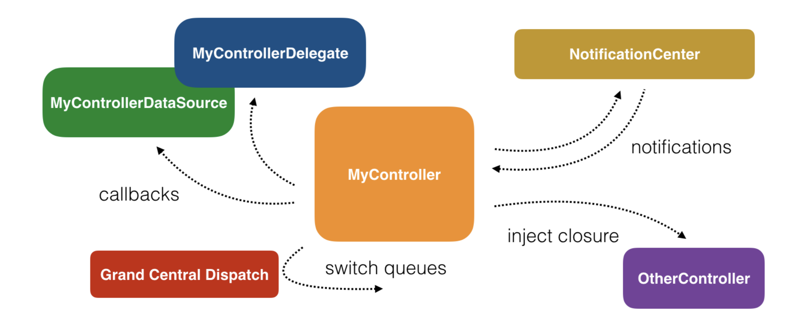

# InstagramSample

Instagram Open API를 이용한 내 게시글 조회 앱

### Languages

- Swift 5.0

### Architecture

- MVC
- MVVM

## Libraries

### [RxSwift](https://github.com/ReactiveX/RxSwift)

리액티브 프로그래밍이란 데이터의 시퀀스를 지켜보다가 데이터의 변화를 비동기로 감지하는 방식의 프로그래밍이다. 이를 Swift에서 잘 사용하도록 라이브러리로 지원해주는 것이 RxSwift이다. 



위의 그림처럼 이미 Apple에서는 여러가지 비동기를 지원해주고 있다. 하지만 이 모든 비동기 API를 적용하면 코드의 일관성이 없어진다. RxSwift는 비동기 시퀀스를 **선언형**으로 작성하기 때문에, 개발자가 코드를 관리하기 편리해진다. 

그 외에도 immutable한 데이터를 비동기로 작성한다는데에 있다.

~~~swift
var array = [1, 2, 3]
var currentIndex = 0

//this method is connected in IB to a button
@IBAction func printNext(_ sender: Any) {
  print(array[currentIndex])
  if currentIndex != array.count-1 {
    currentIndex += 1
  }
}
~~~

위의 코드처럼, Rx를 적용안한 비동기로 사용자가 탭 할때 마다 다음 element를 출력하는 코드이다. 버튼을 3번 탭한다고 가정 했을 때 array가 [1,2,3] 순서대로 나온다는 보장이 없다. 탭을 하고 있는 도중에 printNext()가 아닌 다른 곳에서 array에 접근하여 값을 변경할 수 있기 때문이다. 

하지만 RxSwift는 immutable data를 비동기 코드로 작성이 가능하다. (.map, .filter등 외에도 스트림을 직접 선언하기 때문)

### [RxCocoa](https://github.com/ReactiveX/RxSwift/tree/master/RxCocoa) 

RxSwift는 ReactiveX의 공통 API들을 구현한 라이브러리지만, Cocoa나 UIKit 몇몇 클래스에 대해서는 구현이 되어 있지 않다. 이를 위한 것이 **RxCocoa**이다. 

View와 Data간의 바인딩을 위한 .bind()나 혹은 UI(UIComponent) 이벤트등을 감지할 수 있도록 도와준다.

### [RxDataSources](https://github.com/RxSwiftCommunity/RxDataSources)

UITableView 혹은 UICollectionView와 Data들을 바인딩 해주도록 도와준다. 

Rx에서 가장 중요한 것은 사용자의 이벤트부터 시작해서 데이터 변화의 감지를 구독하는 것까지의 하나의 시퀀스를 정의하는 것이 핵심이다. 하지만 RxCocoa에서는 UICollectionView의 UI 구성하는 컴포넌트에 대해 지원이 되어있지 않다. 이를 위해 개발자가 직접 extension을 구현하거나 혹은 중간에 시퀀스를 끊고 개발자가 직접 리스트 구려주는 로직이 필요한데, 이를 편하게 개발해주도록 도와주는 것이 RxDataSources이다.

### [Alamofire](https://github.com/Alamofire/Alamofire) 

Alamofire는 HTTP request를 도와주는 라이브러리다.

애플의 Foundation 프레임워크의 URLSession으로도 이미 HTTP통신을 할 수 있다. 아래는 URLSession과 Alamofire의 차이점을 보여주는 코드이다.

먼저 Alamofire를 통해 구현한 코드이다.

```swift
Alamofire.request("https://api.mywebserver.com/v1/board", 
                  method: .get, 
                  parameters: ["title": "New York Highlights"])
    .validate(statusCode: 200..<300)
    .responseDecodable { (response: DataResponse) in
        switch response.result {
        case .success(let board):
            print("Created board title is \(board.title)") // New York Highlights
        case .failure(let error):
            print("Board creation failed with error: \(error.localizedDescription)")
        }
}
```

다음은 URLSession을 구현한 코드이다.

~~~swift
enum Error: Swift.Error {
    case requestFailed
}

// Build up the URL
var components = URLComponents(string: "https://api.mywebserver.com/v1/board")!
components.queryItems = ["title": "New York Highlights"].map { (key, value) in
    URLQueryItem(name: key, value: value)
}

// Generate and execute the request
let request = try! URLRequest(url: components.url!, method: .get)
URLSession.shared.dataTask(with: request) { (data, response, error) in
    do {
        guard let data = data,
            let response = response as? HTTPURLResponse, (200 ..< 300) ~= response.statusCode,
            error == nil else {
            // Data was nil, validation failed or an error occurred.
            throw error ?? Error.requestFailed
        }
        let board = try JSONDecoder().decode(Board.self, from: data)
        print("Created board title is \(board.title)") // New York Highlights
    } catch {
        print("Board creation failed with error: \(error.localizedDescription)")
    }
}
~~~

코드의 양만 보더라도 Alamofire가 더욱 간단하고 쉽게 코드 작성이 가능하다. 그 외에도 Result enum을 response로 받아서 HTTP 성공, 실패에 대한 값을 개발자가 다루기 쉽다.

### [AlamofireImage](<https://github.com/Alamofire/AlamofireImage>)  

AlamofireImage는 이미지 컴포넌트 라이브러리이다.

AlamofireImage의 선택 이유는 Image 다운 받는 것과 캐시처리에 대해 편리하기 때문이다. 

~~~swift
let imageCache = AutoPurgingImageCache()
let avatarImage = UIImage(data: data)!

// Add
imageCache.add(avatarImage, withIdentifier: "avatar")

// Fetch
let cachedAvatar = imageCache.image(withIdentifier: "avatar")

// Remove
imageCache.removeImage(withIdentifier: "avatar")
~~~

위의 코드처럼 Cache처리에 대해 편하게 관리가 가능하다. 아래의 코드를 통해 자동으로 관리도 가능하다.

~~~swift
let avatar = imageCache.image(withIdentifier: "avatar")
let circularAvatar = imageCache.image(for: urlRequest, withIdentifier: "circle")
~~~

### [SnapKit](https://github.com/SnapKit/SnapKit) 

SnapKit은 UI Auto Layout을 코드로 그려주는데 도와주는 라이브러리이다. 

애플에서는 그 동안 NSLayoutConstraint, NSLayoutAnchor등을 통해 Constraint를 개발자가 쉽게 그려주도록 도와주기 위해 많은 지원을 해줬었다. 

~~~swift
// Creating constraints using NSLayoutConstraint
NSLayoutConstraint(item: subview,
    attribute: .Leading,
    relatedBy: .Equal,
    toItem: view,
    attribute: .LeadingMargin,
    multiplier: 1.0,
    constant: 0.0).active = true
 
NSLayoutConstraint(item: subview,
    attribute: .Trailing,
    relatedBy: .Equal,
    toItem: view,
    attribute: .TrailingMargin,
    multiplier: 1.0,
    constant: 0.0).active = true
 
 
// Creating the same constraints using Layout Anchors
let margins = view.layoutMarginsGuide
 
subview.leadingAnchor.constraintEqualToAnchor(margins.leadingAnchor).active = true
subview.trailingAnchor.constraintEqualToAnchor(margins.trailingAnchor).active = true
~~~

위의 코드처럼 NSLayoutConstraint 사용법이 어려워 NSLayoutAnchor이 지원이 되면서 더욱 개발자들이 편하게 이용해주도록 도와주었다. 

~~~swift
subview.snp.makeConstraints{
    $0.left.equalTo(view.snp.left)
    $0.right.equalTo(view.snp.right)
}
~~~

하지만 위의 snapkit을 이용한 코드만 보더라도 훨씬 가독성도 좋아지는 것을 볼 수 있다. 이 외에도 Constraint를 update와 다시 설정하는 remake 기능을 통해 훨씬 더 편하게 개발이 가능해진다.


